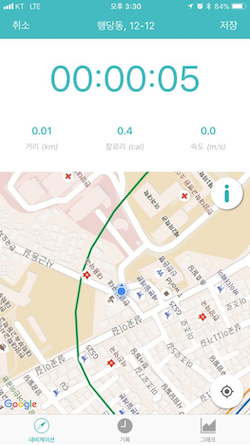
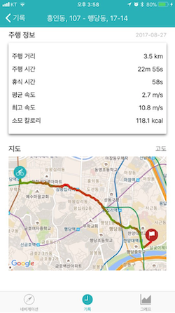
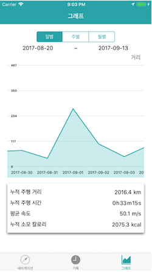
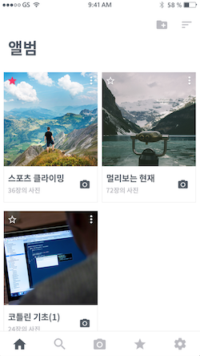
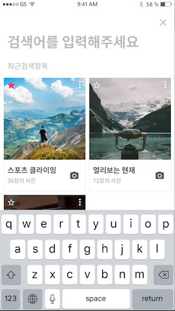
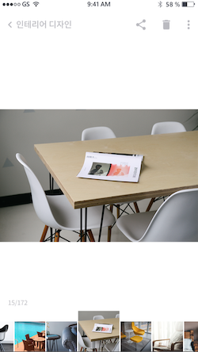
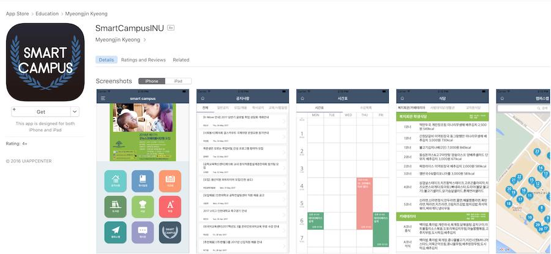

# 조준영

[블로그](https://junyng.github.io/)🖱

## 프로젝트

### 바이피플

> 자전거 네비게이션 앱 - 부스트캠프 2기 프로젝트 
> 2017.08.04 ~ 2017.08.20

  

#### 사용 기술

- Swift 4.0
- GooglePlaces, GooglePlacePicker, GoogleMaps
- Alamofire, Realm, RealmGeoQueries
- FSCalendar, ScrollableGraphView

#### 수행 역할

- Codable, Decodable 프로토콜을 활용한 자전거 편의 시설 JSON 데이터 파싱
- 편의시설 정보, 편의시설 상세정보 화면 제작

##### Github - https://github.com/smart23033/boostcamp_iOS_bipeople

 

### 유니브캠

> 강의 필기 내용을 사진을 찍어 관리할 수 있는 카메라 및 갤러리 앱 
> 2017.06. ~ 2017.08.

#### 사용 기술

- Swift 3.0
- AVFoundation
- RealmSwift

#### 수행 역할

- 앨범 & 포토 뷰 및 커스텀 카메라 뷰 구현
- 스토리보드를 탭 화면 별로 나눠서 관리
- 재사용 되는 CollectionView Cell을 xib 파일로 관리
- 화면 구성 및 Auto Layout 적용

##### Github - https://github.com/junyng/univcam

 

### 스마트 캠퍼스

> 인천대학교 학내 공식 학사정보 어플리케이션 
> 2016.01. ~ 2016.06.

#### 사용 기술

- Swift 3.0
- Core Data
- Alamofire, ObjectMapper, KingFisher, AEXML, Kanna
- XLPagerTabStrip, GoogleMaps, JTAppleCalendar

#### 수행 역할

- Core Data 로컬 데이터베이스 사용
- GCD 네트워크 프로그래밍
- 화면 구성 및 Auto Layout 적용

##### Github - https://github.com/junyng/smart-campus

 

## 수상경력

### 국방위키

> 집단지성을 활용한 서비스 위키 군에 적용 
> 군 장병 대상 공개소프트웨어 캠프 (2018.10.22 ~ 10.26)

- WEB 과정
- 해군참모총장상 수상

##### Github - https://github.com/huhani/mnd-wiki

 

## 활동

### CodeSquad

- 모바일 iOS클래스
- 2019.04.01 ~ 현재

### BoostCamp 2기

- 커넥트재단
- 2017.07.03 ~ 2017.08.20

### NEXTERS

- IT 연합동아리
- 10기 iOS 개발
- 2016.12. ~ 2017.02.

### YAPP

- IT 연합동아리
- 9기 iOS 개발
- 2016.06. ~ 2016.09.

### 인천대 앱센터

- 교내 IT 동아리
- iOS 개발
- 2015.09 ~ 2017.08

